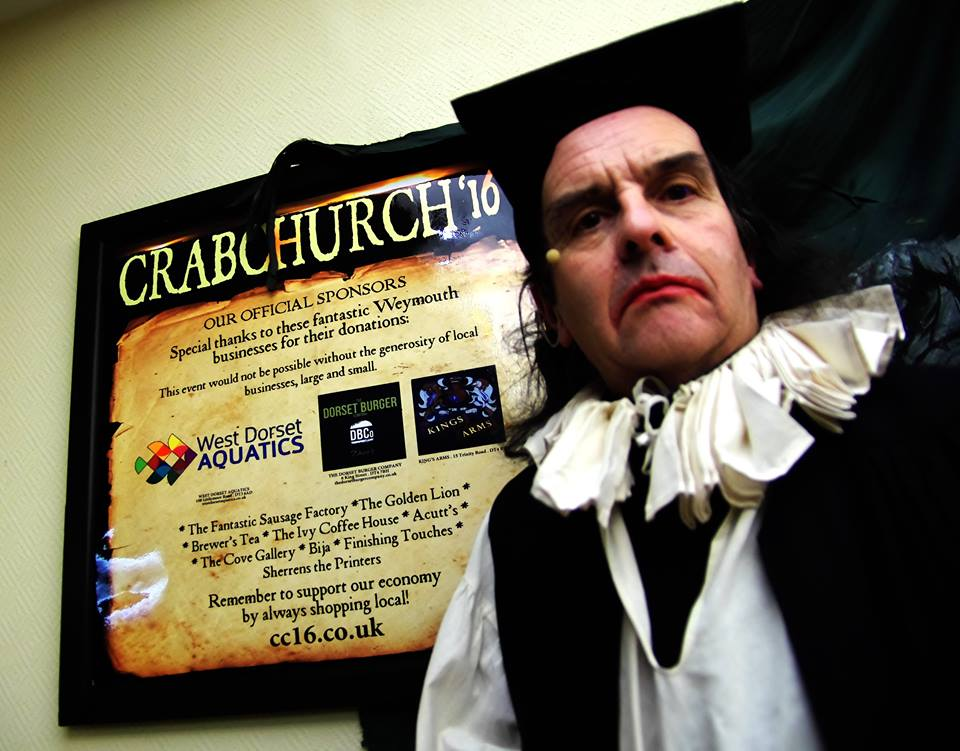

##The Crabchurch Conspiracy Weekend 2016
Saturday 27th and Sunday 28th February 2016
 
###Highlights from last year's celebrations:
 
<iframe width="560" height="315" src="https://www.youtube.com/embed/hsjF1kVPjc0" frameborder="0" allowfullscreen></iframe>
 
<iframe width="560" height="315" src="https://www.youtube.com/embed/vvcdPpB8xJQ" frameborder="0" allowfullscreen></iframe>
 
<iframe width="560" height="315" src="https://www.youtube.com/embed/BOFX1F-lwU8" frameborder="0" allowfullscreen></iframe>
 
<iframe width="560" height="315" src="https://www.youtube.com/embed/Yflu0r2JlE8" frameborder="0" allowfullscreen></iframe>
 
 

The wonderful Preacher Peter Ince at the Twilight Talks.
 

The amazing actress Jane McKell of the [AsOne Theatre Company](http://www.as-onetheatre.co.uk/)
 

The legendary Prof. Ronald Hutton speaks about Prince Rupert of the Rhine.
 

John Rees speaks about the Levellers and the English Revolution.

 

The inimitable Bishop Bray!

Councillor Christine James, the then Mayor of Weymouth speaks after the Twilight Talks.
 

 

And now for something completely different... commemmoration Dolmen-style at the Belvedere Hub.
 

The ghosts of Crabchurch walk around Weymouth
 

Preacher Ince in full flow at the Sunday hangings, with Lewis Griffiths during his dramatic hanging.
 

Steve Piper as Colonel William Sydenham
 

Preacher Ince speaks to locals after the Sunday dramatisations.
 

<a href="http://cc16.co.uk/" target="_blank">

